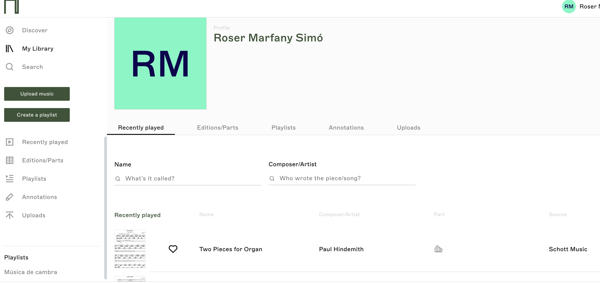

# PAC3: Visionant el futur amb les ulleres de Manovich
### Cultura Digital - Grau Multimèdia (UOC)

Nom: Roser Marfany

Data: Desembre 2023

 

## 1. Introducció

En els estudis de Lev Manovich els conceptes de multimèdia, remediació i hibridació exerceixen un paper crucial en la comprensió de l’evolució dels mitjans en l’era digital. Però quines diferències hi ha entre aquests tres conceptes? La remediació, segons Bolter i Grusin (1999) consisteix en:
>“el procés pel qual un mitjà de comunicació s'apropia de tècniques, formes i/o significació social d'un altre mitjà amb què persegueix rivalitzar o redefinir-se”.

Per altra banda, segons Adell (2014) en la multimèdia:
>“els elements conviuen però cadascun d’ells necessita obrir el seu propi recurs per a ser reproduït (…). En la hibridació, en canvi, es dona una fusió entre els elements (…) generant una experiència nova i coherent que és diferent a l’experimentació dels elements per separat.”

Per tant, en la hibridació, no només es combinen dos o més mitjans si no que es creen noves formes digitals.

Aquest assaig té com a objectiu analitzar dos exemples d’hibridació: Nkoda i la plataforma 3Cat. En aquest sentit, intentarem demostrar com tots dos recursos són un bon exemple d’hibridació de mitjans, ja que combinen diversos elements (imatge, so, documents i vídeos) de forma integrada, es troben disponibles per a diferents dispositius i creen una experiència personalitzada a l’usuari que hi interacciona.    

## 2. Redescobrint la hibridació
### 2.1 Cas 1: Nkoda

Nkoda és un recurs electrònic de pagament que permet l'accés a més de 110.000 partitures digitals dels principals editors de música impresa del món. S’hi pot accedir a través de https://www.nkoda.com/ o descarregant l’aplicació per a IOS i Android.

És un bon exemple de remediació, en el sentit que utilitza el software per oferir accés a partitures que abans només existien en format paper. Però va més enllà, i en paraules de Manovich (2013) ens presenta diversos elements que es fusionen per oferir una experiència nova i coherent, que és diferent a experimentar els elements un per un. En aquest sentit, Nkoda ens presenta diferents mitjans en una única interfície: imatges, documents i so. Les imatges són les portades de les partitures, els documents, les partitures digitalitzades i, el so, són les reproduccions àudio que podem fer de les partitures seleccionades. 

Les imatges, que sempre fan referència a la portada de la partitura, les trobem sobretot a la pàgina principal del recurs, on s’ofereix una selecció de partitures per temes (selecció d’una editorial, d’un autor o d’un conjunt instrumental):

  > Captura d'imatge de la pàgina principal de Nkoda 

Els documents, que són les partitures digitalitzades, es presenten sempre en format pdf. Les lleis del copyright són molt presents a Nkoda i les partitures tenen bloquejada la funció de descàrrega i de captura de pantalla.
Finalment, trobem presència del so en la possibilitat d’escoltar cada una de les partitures que seleccionem. Aquesta funció s’activa a partir de la secció “Playlist”, que ens permet escoltar la partitura mentre s’està visualitzant.

Aquests elements (imatge, documents i so) es combinen en una única interfície que permet a l’usuari personalitzar-la i interactuar-hi. En paraules d’Adell (2014) aquesta hibridació:
>“genera un entorn experiencial totalment diferent i construït sobre unes tècniques de software que permeten una actuació global sobre diferents tipus de dades.”

Nkoda, gràcies a diferents algoritmes, ens permet navegar a través de les partitures de diverses maneres:
- Find: cercador que permet fer una cerca per autor, títol o editorial.
- Explore: cercador que permet fer una cerca per paraula clau.
- Index: permet seleccionar un autor d’una llista de noms ordenada alfabèticament.
- Selecció temàtica de la pàgina principal (selecció de partitures d'una editorial, selecció per temes, etc.).

Pel que fa a la interacció amb aquest mitjà, cal destacar la possibilitat d’incloure anotacions a les partitures. S’inclouen infinitat de possibilitats, igual que faríem si la partitura fos en paper i ho haguéssim de fer a mà (esborrar, canviar de color, escriure, etc.):

> Captura d'imatge de Nkoda amb anotacions a una partitura

Un altre element important que ofereix Nkoda és la personalització de la interfície. S’ofereix la possibilitat de crear una biblioteca personalitzada anomenada “My library” de partitures seleccionades per l’usuari que es podran recuperar i consultar juntes en qualsevol moment sense haver de tornar a fer una cerca.

 
> Captura d'imatge de la pàgina "My library" de Nkoda 

En resum, Nkoda és un clar exemple d’hibridació que combina imatges, documents i so en una única interfície i que ofereix a l’usuari una experiència personalitzada, permetent-li introduir anotacions a les partitures i crear una biblioteca personal.

### 2.2 Cas 2: 3Cat

Segons Viquipèdia (2023), la plataforma 3Cat és la fusió entre els diferents mitjans que formen part de la Corporació Catalana de Mitjans Audiovisuals (CCMA): Televisió de Catalunya (...) i Catalunya Ràdio. S’hi pot accedir de forma gratuïta a través de: https://www.ccma.cat/3cat/, descarregant l’aplicació per a IOS i Android o des d’un televisor intel·ligent.

Aquesta plataforma digital incorpora diferents elements de la ràdio i el cinema en un únic recurs de forma integrada. En aquest sentit, podem trobar so -representat a través dels pòdcasts-, vídeos, -en forma de sèries i pel·lícules- i imatges, que representen cada un dels elements que es poden visionar o reproduir. 

> Captura d'imatge de la pàgina principal de 3Cat 

Aquests elements (so, vídeos i imatges) es combinen en una única interfície que permet a l’usuari personalitzar-la i interactuar-hi. En aquest sentit, es compleix a la perfecció la definició d’hibridació segons Adell (2014): 
>“l’experiència és una, unificada en un mateix entorn de reproducció, els elements -tot i ser de tipologies diferents- comparteixen les mateixes tècniques per a ser reproduïts en conjunt, uns fusionats amb els altres, aportant cadascun les seves potencialitats a l’experiència global de la comunicació amb l’usuari.”

La plataforma 3Cat, gràcies a diferents algoritmes, ens permet navegar a través dels vídeos i pòdcasts de diferents maneres:
- Cercador per paraula clau.
- Menú superior ordenat per seccions (directes, entreteniment, sèries, pòdcasts, el més top, la meva llista i explora).
- Menú superior “Explora”. Presenta una selecció de temes d’interès (actualitat, esports, cuines, etc.).
- Selecció temàtica de la pàgina principal. La pàgina principal està organitzada per temes d’interès diferents dels de la secció “Explora” (Directes, Novetats, Un Nadal de pel·lícula, Estic veient, Estic escoltant, etc.).

La interacció amb la interfície es realitza navegant pels vídeos i pòdcasts, ja siguin programes en directe o enregistrats amb anterioritat.

La interfície es pot personalitzar de dues maneres. La primera consisteix en crear una selecció personalitzada dels pòdcasts o vídeos del nostre interès afegint-los a la secció “La meva llista”. La segona, que funciona de forma automatitzada, es fa a partir de les nostres preferències. En funció dels vídeos i pòdcasts escoltats, els algoritmes de la plataforma ens seleccionen altres elements similars del nostre interès i els posicionen a la secció “Recomanats per a tu”.

> Captura d'imatge de la secció "Recomanats per a tu" de 3Cat

En resum, la plataforma 3Cat és un clar exemple d’hibridació, ja que incorpora diferents elements de la ràdio i el cinema, com pòdcasts, imatges i vídeos, en una únic recurs de forma integrada, permetent a l'usuari crear una experiència personalitzada.

## 3. Valoració personal
En aquest assaig s'ha analitzat el concepte d'hibridació de mitjans a partir de dos exemples: Nkoda i 3Cat. Aquests dos casos ens han servit per ilustrar com la combinació de diferents mitjans -en el cas de Nkoda, la música impresa, el so i la imatge i, en el cas de 3Cat, la ràdio i el cinema-, ha donat lloc a la creació de noves formes digitals, que combinen els elements de forma integrada creant una experiència personalitzada a l'usuari. Aquests exemples demostren que la hibridació de mitjans, en contrast amb la remediació i la multimèdia, impliquen la fusió de diferents mitjans per generar noves formes digitals, redefinint la creació i el consum dels continguts. 

Aquest anàlisi també ens demostra que la hibridació de mitjans es troba present en tots els àmbits, des de la música fins als mitjans audiovisuals, reafirmant el seu paper central en la configuració del paisatge mediàtic contemporani.

Finalment, també cal destacar l'ús del llenguatge MarkDown i del repositori GitHub, que desconeixia totalment, però que m'han permès descobrir una nova manera de treballar. Ha estat interessant veure els treballs d'altres companys per agafar idees sobre el disseny i la redacció amb MarkDown i poder, d'aquesta manera, millorar la PAC. 

## 4. Bibliografia

- 3Cat, *Wikipedia: l'enciclopèdia lliure*. [consulta: 7/12/2023]. https://ca.wikipedia.org/wiki/3Cat
- Adell, F. [Ferran]. (2014). Remediació, multimèdia i hibridació dels mitjans. *Fonaments i evolució de la multimèdia*. http://multimedia.uoc.edu/blogs/fem/remediacio-multimedia-i-hibridacio-dels-mitjans/
- Alberich-Pascual, J. [Jordi]. (2018). Elementos de la creatividad multimedia: apropiación, remediación, hibridación. *Mosaic*, 156. https://doi.org/10.7238/m.n156.1803
- Bolter J. D. [Jay David] & Grusin R. A. [Richard Arthur]. (1999). *Remediation: understanding new media*. MIT Press.
- Cristóbal, J. [Javier]. (2023). *Qué es Markdown*. [consulta; 11/12/2023]. https://markdown.es/
- Manovich, Lev. (2013). *El Software toma el mando*. Barcelona: Editorial UOC

----

Licencia: Material Creative Commons desarrollado bajo licencia CC BY-SA 4.0. Imágenes CC BY [Tubik studio](https://blog.tubikstudio.com/how-to-create-original-flat-illustrations-designers-tips/) 
